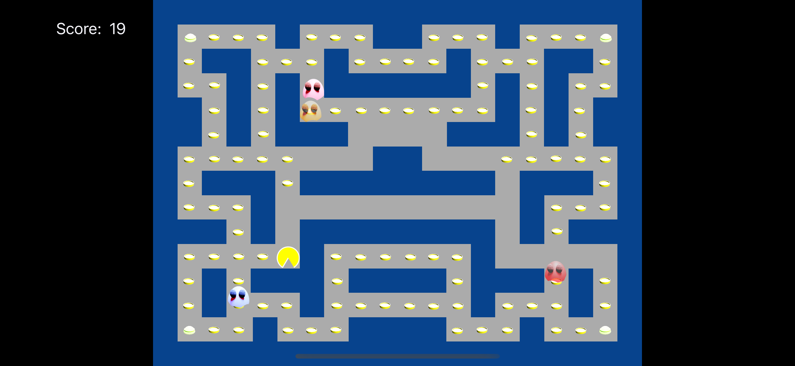
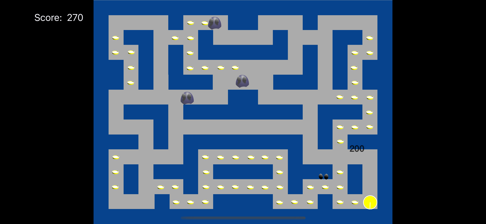

# Pac Man Style Game in 260 lines of Swift5 using SpriteKit

This is an in-class example program created in March 2023 for Wright State University CS-3170, "Mobile App Development". Each semester, I create several new Apps from start to a modest level of completeness as live performace art coding demonstrations. I asked the class what they wanted in MArch 2023, and they said they wanted PacMan. At the time of this writing, three class periods comprised of explanations as the code is written have been invested in this project.

 
 
## Features

- Pac Man is implemented as a ShapeNode with UIBezierPath used to draw the mouth opening and closing animation.
- Ghosts, pellets, and "eyes" are original 3D models made in Blender and rendered into iamges for 2D display.
- Pan gestures are used to set PacMan in motion and change his direction.
- Power-Up pellets work as expected, and ghosts become temorarily vulnerable.
- When vulnerable ghosts are eaten, their "eyes" return to teh ghost's home position and respwand as new ghosts.
- When ghosts and pellets are eaten, a score changes.
- When ghosts are eaten, an animation identifies how many points are awarded with point amounts increasing based on teh number of ghosts eaten per Power-Up.
- SpriteKit physics are used to pervent walking through walls and detect contacts between nodes.
- Sprite Kit Actions implement animations and game logic that isn't provided for free by the physics engine.
- Original sound effects were recorded in class on a terrible microphone.

## Note Th 260 lines citation includes blank lines and comments but does not include code provided by the Xcode project template for SpriteKit Games.
